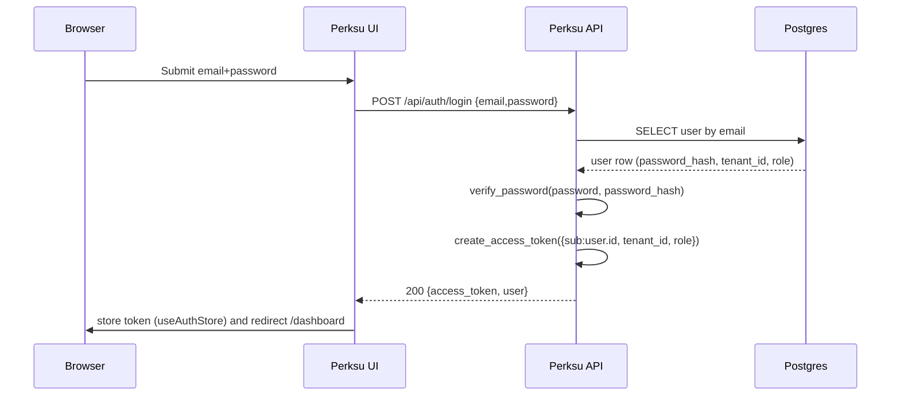
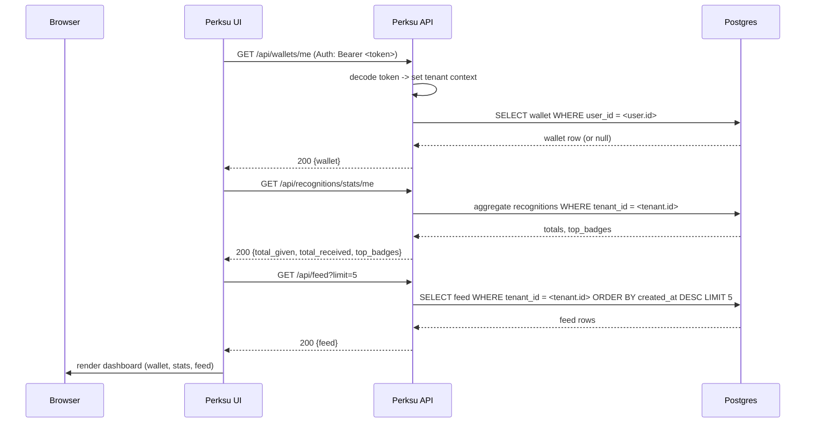
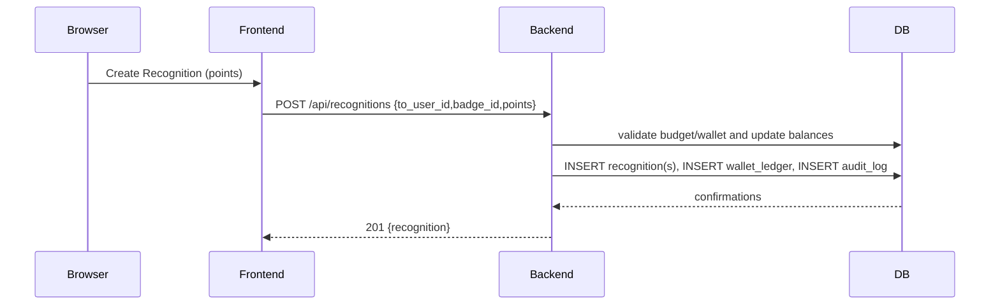

# Tenant Dashboard Sequence Diagrams (Mermaid)

## 1) Login Flow (Password)

```mermaid
sequenceDiagram
  participant Browser
  participant Frontend as Perksu UI
  participant Backend as Perksu API
  participant DB as Postgres

  Browser->>Frontend: Submit email+password
  Frontend->>Backend: POST /api/auth/login {email,password}
  Backend->>DB: SELECT user by email
  DB-->>Backend: user row (password_hash, tenant_id, role)
  Backend->>Backend: verify_password(password, password_hash)
  Backend->>Backend: create_access_token({sub:user.id, tenant_id, role})
  Backend-->>Frontend: 200 {access_token, user}
  Frontend->>Browser: store token (useAuthStore) and redirect /dashboard
```

## 2) Dashboard Data Fetch (after login)

```mermaid
sequenceDiagram
  participant Browser
  participant Frontend as Perksu UI
  participant Backend as Perksu API
  participant DB as Postgres

  Frontend->>Backend: GET /api/wallets/me (Auth: Bearer <token>)
  Backend->>Backend: decode token -> set tenant context
  Backend->>DB: SELECT wallet WHERE user_id = <user.id>
  DB-->>Backend: wallet row (or null)
  Backend-->>Frontend: 200 {wallet}

  Frontend->>Backend: GET /api/recognitions/stats/me
  Backend->>DB: aggregate recognitions WHERE tenant_id = <tenant.id>
  DB-->>Backend: totals, top_badges
  Backend-->>Frontend: 200 {total_given, total_received, top_badges}

  Frontend->>Backend: GET /api/feed?limit=5
  Backend->>DB: SELECT feed WHERE tenant_id = <tenant.id> ORDER BY created_at DESC LIMIT 5
  DB-->>Backend: feed rows
  Backend-->>Frontend: 200 {feed}

  Frontend->>Browser: render dashboard (wallet, stats, feed)
```

## 3) Recognition Create (simplified)

```mermaid
sequenceDiagram
  Browser->>Frontend: Create Recognition (points)
  Frontend->>Backend: POST /api/recognitions {to_user_id,badge_id,points}
  Backend->>DB: validate budget/wallet and update balances
  Backend->>DB: INSERT recognition(s), INSERT wallet_ledger, INSERT audit_log
  DB-->>Backend: confirmations
  Backend-->>Frontend: 201 {recognition}
```
